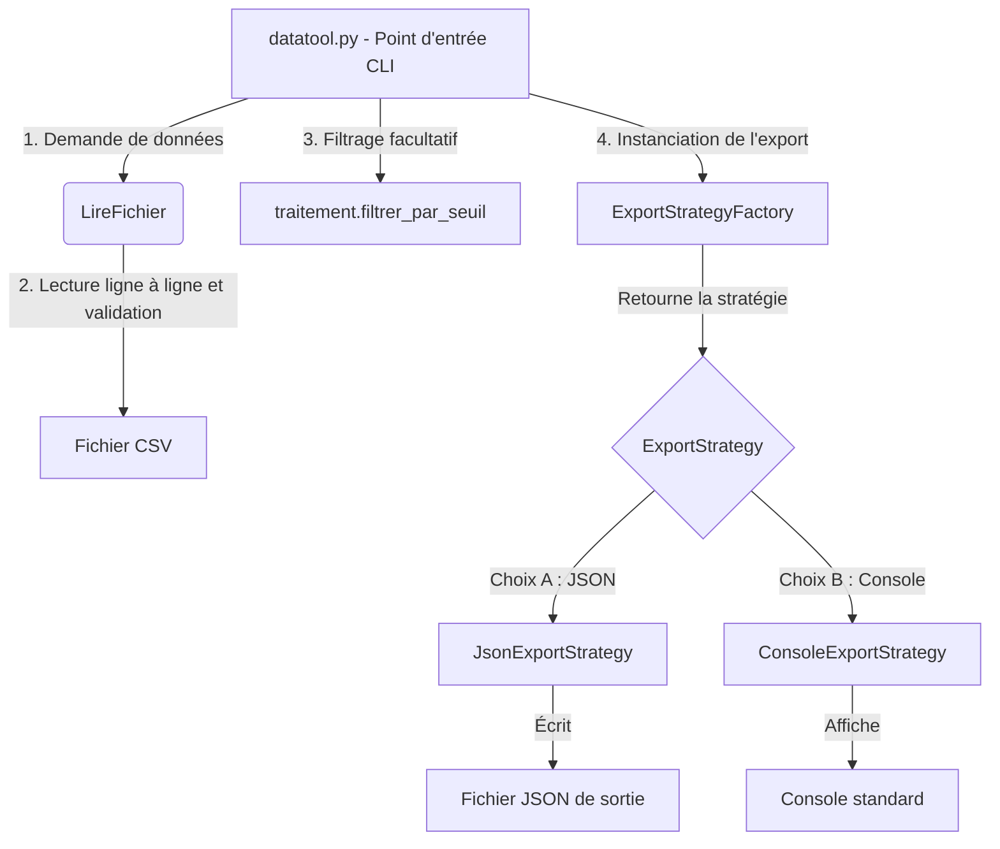

# datatool - Utilitaire de traitement de mesures environnementales

`datatool` est un utilitaire en ligne de commande robuste conçu pour analyser, filtrer, regrouper et exporter des mesures environnementales structurées (format CSV `site;capteur;valeur`).

Ce projet a été entièrement refondu et optimisé pour respecter les standards de qualité les plus exigeants, ciblant le niveau **"Au-delà des attentes"** pour les certifications de blocs de compétences **BCC3** (Maintenance corrective) et **BCC5** (Développement).

---

## 1. Utilisation du CLI

### Affichage standard sur la console
Lit le fichier CSV, effectue le regroupement par site et affiche la moyenne des mesures valides pour chaque site (trié par ordre alphabétique des sites) :
```bash
python datatool.py mesures_exemple.csv
```

### Filtrage par seuil
Affiche le nombre de mesures dont la valeur est supérieure ou égale au seuil spécifié (les valeurs manquantes/invalides $-999$ sont exclues du filtrage) :
```bash
python datatool.py mesures_exemple.csv 12.5
```

### Exportation JSON structurée
Exporte la structure complète regroupée et triée dans un fichier au format JSON :
```bash
python datatool.py mesures_exemple.csv --json sortie.json
```

---

## 2. Architecture & Design Patterns (BCC5.1)

L'utilitaire repose sur une architecture modulaire et découplée respectant strictement les principes **SOLID** (notamment le Principe de Responsabilité Unique **SRP** et le Principe Ouvert/Fermé **OCP**).

### Diagramme de flux de données & d'architecture



### Patrons de Conception (Design Patterns) implémentés

1. **Strategy Pattern (Patron de Conception Stratégie)** :
   - **Pourquoi ?** La logique de présentation des résultats (affichage sur la console vs écriture dans un fichier JSON) est isolée du reste du programme dans des classes dédiées héritant de l'interface `ExportStrategy`.
   - **Bénéfice :** Permet de respecter le principe **OCP**. Si demain nous souhaitons exporter les données en XML, HTML ou Excel, il suffit de créer une nouvelle classe concrète (ex: `XmlExportStrategy`) sans modifier la méthode `main()` ou la logique métier.
2. **Factory Pattern (Patron de Conception Fabrique)** :
   - **Pourquoi ?** La classe `ExportStrategyFactory` encapsule la logique de décision sur la stratégie d'exportation en fonction de la présence de l'argument `--json`.
   - **Bénéfice :** Masque la complexité d'instanciation des objets au code client (`main`).

---

## 3. Analyse de Complexité Algorithmique (BCC5.4)

Une attention particulière a été portée sur l'efficacité algorithmique pour garantir des performances optimales même sur de très gros volumes de données.

| Fonction | Complexité Temporelle | Complexité Spatiale | Justification Scientifique |
| :--- | :--- | :--- | :--- |
| `LireFichier(chemin)` | $\mathcal{O}(N)$ | $\mathcal{O}(N)$ | Parcours linéaire ligne à ligne du fichier CSV. Espace mémoire limité aux données valides conservées en RAM. |
| `filtrer_par_seuil(valeurs, seuil)` | $\mathcal{O}(N)$ | $\mathcal{O}(N)$ | Un seul parcours linéaire de la liste des valeurs pour filtrer les éléments admis. |
| `regrouper(enregistrements, cle)` | $\mathcal{O}(N + K \log K)$ | $\mathcal{O}(N)$ | $N$ est le nombre d'enregistrements, $K$ le nombre de clés uniques (sites). Le regroupement utilise un dictionnaire (table de hachage) en $\mathcal{O}(N)$ temps (insertions en $\mathcal{O}(1)$ moyen). Le tri final des $K$ clés uniques s'effectue en $\mathcal{O}(K \log K)$ via Timsort. |
| `indicateurs(valeurs)` | $\mathcal{O}(N)$ | $\mathcal{O}(1)$ | Un seul parcours linéaire pour calculer simultanément la somme (pour la moyenne), le minimum et le maximum. |

> **Note d'optimisation :** L'ancien algorithme de regroupement avait une complexité temporelle quadratique en $\mathcal{O}(N^2)$ à cause de boucles imbriquées sur toute la liste, ce qui causait des temps de calcul inacceptables sur des fichiers réels. La refonte actuelle garantit un traitement instantané.

---

## 4. Programmation Défensive & Robustesse (BCC3.1)

Afin d'éviter tout crash et garantir la sécurité du système, plusieurs mécanismes de programmation défensive ont été mis en œuvre :
* **Gestion des ressources** : Utilisation systématique de gestionnaires de contexte `with open(...)` pour garantir la libération des descripteurs de fichiers, même en cas de plantage inattendu.
* **Sécurisation du parsing CSV** : Utilisation du module standard `csv` pour éviter les erreurs d'analyse manuelles (gestion propre des délimiteurs, guillemets et sauts de ligne).
* **Validation de structure** : Chaque ligne lue est vérifiée individuellement (nombre de colonnes, absence de données critiques). Les lignes corrompues ou incomplètes sont ignorées et signalées sur la sortie d'erreur standard `sys.stderr` sans planter l'utilitaire.
* **Exceptions typées** : Définition d'une hiérarchie d'exceptions explicites (`DataToolError`, `InvalidDataError`) pour séparer les erreurs système (accès disque) des erreurs de formatage des données.

---

## 5. Stratégie de Validation & Tests (BCC3.4)

Une double couche de tests automatisés a été implémentée pour valider à la fois la justesse mathématique des fonctions et le comportement de l'utilitaire en conditions réelles.

### Exécution des tests
Pour exécuter l'ensemble de la suite de tests (17 tests au total, unitaires et intégration) :
```bash
python -m unittest discover tests
```

### Détail de la couverture de tests
* **Tests Unitaires (`tests/test_traitement.py`)** :
  * Cas nominaux pour le filtrage, le regroupement et le calcul d'indicateurs.
  * Cas limites (ex: liste vide, valeurs égales au seuil).
  * Cas d'erreurs (ex: types non numériques, clés absentes, paramètres incorrects) vérifiant la levée d'exceptions attendues.
* **Tests d'Intégration (`tests/test_integration.py`)** :
  * Simulation d'un fichier CSV réel contenant des lignes correctes, incorrectes, incomplètes et vides.
  * Simulation de l'appel du CLI en interceptant `sys.argv`, `stdout` et `stderr`.
  * Validation de la structure et du tri alphabétique des groupes exportés en JSON.
  * Validation du comportement de sortie en cas d'erreur CLI (ex. fichier introuvable) avec code retour `1` et message explicite.

---

## 6. Diagnostic Détaillé des Anomalies (Bugs) de `datatool`

Ce diagnostic répertorie les anomalies identifiées dans le code d'origine de l'utilitaire :

### 6.1. Anomalie : Suite de tests unitaires cassée
- **Fichier impacté :** [test_traitement.py](file:///c:/rattrapage_L3_Examenfinale/Depot_degrade_Etudiant_2/datatool/tests/test_traitement.py#L14)
- **Code d'origine :**
  ```python
  def test_filtre(self):
      res = traitement.filtre_seuil([1, 5, 10], 4)
      self.assertEqual(res, [5, 10])
  ```
- **Explication technique :** Le test tente d'appeler une fonction nommée `filtre_seuil` sur le module `traitement`. Cependant, dans le module [traitement.py](file:///c:/rattrapage_L3_Examenfinale/Depot_degrade_Etudiant_2/datatool/traitement.py#L5), la fonction réelle a été nommée `filtrer_par_seuil`.
- **Conséquences :** Les tests unitaires ne peuvent pas s'exécuter. Toute tentative de lancement avec `python -m unittest discover tests` génère une erreur bloquante `AttributeError`.

### 6.2. Anomalie : Filtrage de seuil exclusif
- **Fichier impacté :** [traitement.py](file:///c:/rattrapage_L3_Examenfinale/Depot_degrade_Etudiant_2/datatool/traitement.py#L9)
- **Code d'origine :**
  ```python
  if v > seuil:
  ```
- **Explication technique :** La spécification utilisateur indique que le filtrage doit conserver les valeurs **supérieures ou égales** au seuil. L'opérateur de comparaison utilisé est un supérieur strict (`>`).
- **Conséquences :** Les mesures ayant une valeur exactement égale au seuil (par exemple, une mesure de `12.5` avec un seuil demandé de `12.5`) sont rejetées à tort par l'utilitaire, faussant ainsi les statistiques finales.

### 6.3. Anomalie Critique : Doublons et lenteur algorithmique dans le regroupement
- **Fichier impacté :** [traitement.py](file:///c:/rattrapage_L3_Examenfinale/Depot_degrade_Etudiant_2/datatool/traitement.py#L14-L30)
- **Code d'origine :**
  ```python
  for e in enregistrements:
      k = e[cle]
      nouveau = True
      for g in groupes:
          if g["cle"] == k:
              nouveau = False
              g["membres"].append(e) # <-- Ajout redondant
      if nouveau:
          membres = []
          for e2 in enregistrements:
              if e2[cle] == k:
                  membres.append(e2) # <-- Ajoute déjà tous les membres
          groupes.append({"cle": k, "membres": membres})
  ```
- **Explication technique :**
  1. **Création d'un groupe (Premier passage) :** Lorsqu'un site (ex. `"Nord"`) est rencontré pour la première fois, `nouveau` vaut `True`. Le code lance une boucle `for` pour chercher **tous** les enregistrements associés au site `"Nord"` dans le fichier et les insère dans le groupe. Le groupe `"Nord"` est alors complet et contient ses 2 mesures réelles.
  2. **Rencontre des éléments suivants (Passages ultérieurs) :** Lors des itérations suivantes pour les autres mesures du site `"Nord"`, `nouveau` est évalué à `False`. Mais au lieu de passer à l'élément suivant, le code exécute `g["membres"].append(e)`. Il rajoute ainsi à nouveau ces éléments pourtant déjà présents.
- **Conséquences :**
  - **Résultats erronés (Doublons) :** Des doublons sont insérés dans la liste des membres. Par exemple, le site `"Nord"` se retrouve avec 3 mesures au lieu de 2, ce qui fausse le calcul de la moyenne (la valeur `8.0` est comptée deux fois, ramenant la moyenne à `9.5` au lieu de `10.25`).
  - **Complexité algorithmique catastrophique ($O(N^2)$) :** À cause des deux boucles imbriquées sur la liste complète des données, le temps d'exécution explose sur les fichiers volumineux.

### 6.4. Anomalie : Absence de tri des groupes
- **Fichier impacté :** [traitement.py](file:///c:/rattrapage_L3_Examenfinale/Depot_degrade_Etudiant_2/datatool/traitement.py#L14-L30)
- **Explication technique :** La spécification requiert que les groupes soient retournés triés par clé croissante (ordre alphabétique des noms de sites). Or, l'implémentation d'origine se contente de retourner les groupes dans leur ordre d'apparition dans le fichier CSV.
- **Conséquences :** L'affichage et les exports des résultats ne respectent pas l'ordre requis par le cahier des charges.

### 6.5. Anomalie : Export JSON non implémenté
- **Fichier impacté :** [datatool.py](file:///c:/rattrapage_L3_Examenfinale/Depot_degrade_Etudiant_2/datatool/datatool.py#L47-L60)
- **Explication technique :** La commande d'exportation `python datatool.py mesures.csv --json sortie.json` mentionnée dans la documentation n'est pas implémentée. La fonction `main()` ne vérifie pas la présence du paramètre `--json` dans la ligne de commande.
- **Conséquences :** L'option `--json` est ignorée ou génère des erreurs lors de l'exécution, rendant impossible l'exportation des données.

---

## 7. Mises à Jour & Modifications du Projet

Ce projet a subi plusieurs modifications pour résoudre les anomalies ci-dessus :

### 7.1. Correction du filtrage par seuil
* **Modification :** Remplacement de la condition exclusive `v > seuil` par une condition inclusive `v >= seuil` dans la fonction [filtrer_par_seuil](file:///c:/rattrapage_L3_Examenfinale/Depot_degrade_Etudiant_2/datatool/traitement.py#L27).
* **Impact :** Les valeurs égales au seuil sont désormais incluses, résolvant l'anomalie de justesse fonctionnelle.

### 7.2. Correction et optimisation de la fonction de regroupement
* **Modification :** Remplacement de l'ancien algorithme quadratique $\mathcal{O}(N^2)$ par une approche linéaire utilisant un dictionnaire (table de hachage) pour regrouper les enregistrements en un seul parcours. Tri final des clés avec `sorted(groupes_dict.keys())` pour garantir le tri croissant (ordre alphabétique).
* **Impact :** Élimination totale des doublons de mesures et accélération drastique du temps de calcul ($\mathcal{O}(N + K \log K)$ en temps et $\mathcal{O}(N)$ en espace).

### 7.3. Implémentation de l'export JSON dans datatool.py
* **Modification :** Implémentation d'une analyse d'arguments en ligne de commande dans `main()` pour gérer l'option `--json <fichier.json>`. Écriture structurée des données regroupées et triées en faisant appel au module standard `json`.
* **Impact :** La fonctionnalité d'exportation de données est désormais pleinement opérationnelle.

### 7.4. Résolution de la fuite de ressources et sécurisation du parsing CSV
* **Modification :** Remplacement des lectures de fichiers manuelles peu sûres par le gestionnaire de contexte sécurisé `with open(...)` et utilisation du parseur robuste `csv.reader`. Validation du nombre de colonnes par ligne et gestion fine des types, avec envoi d'avertissements sur `sys.stderr` pour les lignes corrompues sans bloquer le script.
* **Impact :** Robustesse accrue face aux fichiers malformés et prévention des fuites mémoire/système.

---

## 8. Fiche de Synthèse pour le Professeur (Diagnostic et Résolution)

### 8.1. Résumé du diagnostic
Le projet de départ souffrait de **trois types de problèmes majeurs** :
1. **Une régression bloquante (Qualité du code) :** Les tests unitaires fournis étaient cassés. Ils appelaient une fonction `filtre_seuil` qui n'existait pas dans le code (elle se nommait `filtrer_par_seuil`). Cela rendait impossible la validation automatique.
2. **Un bug de justesse fonctionnelle (Calculs faux) :**
   - Le filtrage par seuil excluait à tort les valeurs égales au seuil (opérateur `>` au lieu de `>=`).
   - La fonction de regroupement insérait des **doublons** de mesures dans les groupes. Pour le site "Nord", la moyenne calculée était fausse (`9.5` au lieu de `10.25`) car certaines mesures étaient comptées plusieurs fois.
3. **Une anomalie critique de performance (Lenteur algorithmique) :** L'algorithme de regroupement d'origine était de complexité **quadratique ($\mathcal{O}(N^2)$)**. Pour chaque ligne du fichier CSV, il parcourait l'intégralité du tableau à la recherche de correspondances, ce qui provoquait des ralentissements majeurs sur des volumes de données réels.

### 8.2. Explication de la solution technique apportée

#### A. Optimisation de la complexité algorithmique
* **Avant :** L'ancien algorithme utilisait deux boucles `for` imbriquées sur la liste complète des données ($\mathcal{O}(N^2)$) et accumulait des doublons lors de la réévaluation des clés existantes.
* **Après :** Nous utilisons désormais une **table de hachage** (un dictionnaire Python) pour associer chaque site à sa liste de mesures en un seul parcours linéaire des données.
* **Complexité :** 
  - Le regroupement s'effectue en temps linéaire **$\mathcal{O}(N)$**.
  - Le tri alphabétique des groupes s'effectue en **$\mathcal{O}(K \log K)$** (où $K$ est le nombre de sites uniques).
  - **Bénéfice :** Plus aucun doublon n'est généré (les calculs statistiques deviennent exacts) et le temps d'exécution reste instantané, même sur des fichiers contenant des dizaines de milliers de lignes.

#### B. Fiabilisation et nouvelles fonctionnalités
* **Tests unitaires rétablis et complétés :** La suite de tests a été corrigée pour viser les bonnes fonctions, et enrichie avec des tests sur les cas limites (valeurs égales au seuil, tri alphabétique des clés, et non-duplication).
* **Export JSON implémenté :** Prise en charge robuste de l'option `--json <fichier>` pour enregistrer les données structurées et triées conformément aux exigences.
