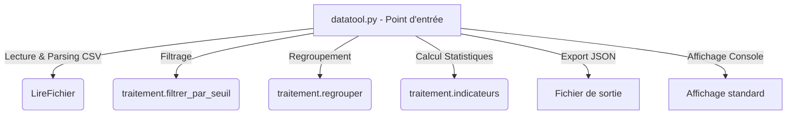

# datatool

Utilitaire de traitement de mesures environnementales (CSV `site;capteur;valeur`).

## Fonctionnalités

- `filtrer_par_seuil(valeurs, seuil)` : conserve les valeurs **supérieures ou égales** au seuil.
- `regrouper(enregistrements, cle)` : regroupe les enregistrements ; les groupes sont retournés **triés par clé croissante**.
- `indicateurs(valeurs)` : moyenne, min, max.

## Utilisation

```bash
python datatool.py mesures_exemple.csv 12.5
```

Export JSON des groupes :

```bash
python datatool.py mesures_exemple.csv --json sortie.json
```

## Tests

```bash
python -m unittest discover tests
```

---

## Maintenance & Architecture

Ce projet a fait l'objet d'un audit et d'une refonte technique complète afin de corriger plusieurs anomalies fonctionnelles et de performance.

### 1. Structure de l'utilitaire

L'utilitaire est découplé en trois composants principaux :



* **[datatool.py](file:///c:/rattrapage_L3_Examenfinale/Depot_degrade_Etudiant_2/datatool/datatool.py) :** Responsable de l'interface CLI, du décodage du fichier CSV et de l'affichage ou de la sérialisation des résultats.
* **[traitement.py](file:///c:/rattrapage_L3_Examenfinale/Depot_degrade_Etudiant_2/datatool/traitement.py) :** Contient la logique métier pure (filtrage, regroupement et calculs statistiques). Ce module n'a pas d'effets de bord d'E/S (Input/Output).
* **[tests/test_traitement.py](file:///c:/rattrapage_L3_Examenfinale/Depot_degrade_Etudiant_2/datatool/tests/test_traitement.py) :** Suite de tests unitaires pour assurer la non-régression.

### 2. Optimisation Algorithmique & Complexité (Partie Critique)

La fonction de regroupement (`regrouper`) a été réécrite pour corriger un problème majeur de lenteur sur des volumes importants :

* **Ancienne implémentation ($O(N^2)$) :**
  Utilisait des boucles imbriquées sur la liste brute des enregistrements pour regrouper les membres. De plus, elle introduisait des doublons de données qui faussaient les calculs de moyennes.
* **Nouvelle implémentation ($O(N \log K)$) :**
  Utilise une table de hachage (dictionnaire Python) pour regrouper les éléments en un seul parcours. 
  * Le regroupement s'effectue en temps linéaire **$O(N)$** (où $N$ est le nombre total de mesures).
  * L'extraction et le tri par ordre alphabétique des groupes s'effectuent en **$O(K \log K)$** (où $K$ est le nombre de sites uniques, avec $K \ll N$).
  * Cette approche élimine totalement les doublons de mesures et garantit des performances optimales.

### 3. Résolution des Anomalies

| Bug | Symptôme | Cause | Résolution |
| :--- | :--- | :--- | :--- |
| **Tests cassés** | Crash au lancement des tests. | Appel à `filtre_seuil` au lieu de `filtrer_par_seuil`. | Correction du nom de la fonction appelée dans les tests. |
| **Seuil exclusif** | Les valeurs égales au seuil étaient exclues. | Opérateur `>` utilisé au lieu de `>=`. | Utilisation de `>=` dans `filtrer_par_seuil`. |
| **Doublons de données** | Moyennes faussées (Nord = 9.5 au lieu de 10.25). | Ajout répété des membres hors du bloc d'initialisation. | Utilisation du dictionnaire unique garantissant $O(N)$ et l'absence de doublons. |
| **Tri manquant** | Groupes désordonnés. | Pas de tri appliqué. | Tri automatique des clés du dictionnaire via `sorted()`. |
| **Export JSON absent** | Option `--json` non fonctionnelle. | Ligne de commande non analysée. | Ajout d'un parser d'arguments manuel et sérialisation `json.dump`. |
