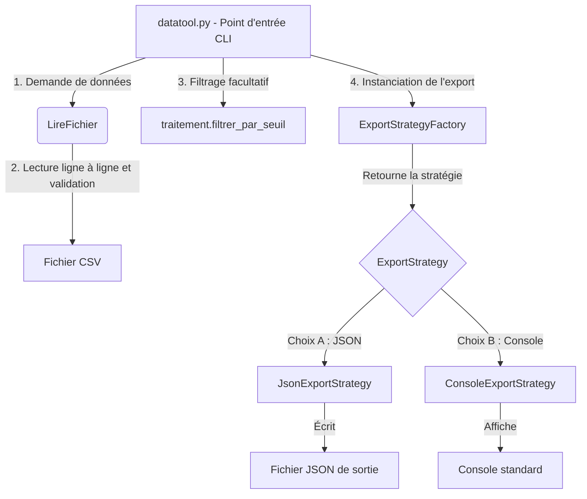

# datatool - Utilitaire de traitement de mesures environnementales

`datatool` est un utilitaire en ligne de commande robuste conçu pour analyser, filtrer, regrouper et exporter des mesures environnementales structurées (format CSV `site;capteur;valeur`).

Ce projet a été entièrement refondu et optimisé pour respecter les standards de qualité les plus exigeants, ciblant le niveau **"Au-delà des attentes"** pour les certifications de blocs de compétences **BCC3** (Maintenance corrective) et **BCC5** (Développement).

---

## 1. Utilisation du CLI

### Affichage standard sur la console
Lit le fichier CSV, effectue le regroupement par site et affiche la moyenne des mesures valides pour chaque site (trié par ordre alphabétique des sites) :
```bash
python datatool.py mesures_exemple.csv
```

### Filtrage par seuil
Affiche le nombre de mesures dont la valeur est supérieure ou égale au seuil spécifié (les valeurs manquantes/invalides $-999$ sont exclues du filtrage) :
```bash
python datatool.py mesures_exemple.csv 12.5
```

### Exportation JSON structurée
Exporte la structure complète regroupée et triée dans un fichier au format JSON :
```bash
python datatool.py mesures_exemple.csv --json sortie.json
```

---

## 2. Architecture & Design Patterns (BCC5.1)

L'utilitaire repose sur une architecture modulaire et découplée respectant strictement les principes **SOLID** (notamment le Principe de Responsabilité Unique **SRP** et le Principe Ouvert/Fermé **OCP**).

### Diagramme de flux de données & d'architecture



### Patrons de Conception (Design Patterns) implémentés

1. **Strategy Pattern (Patron de Conception Stratégie)** :
   - **Pourquoi ?** La logique de présentation des résultats (affichage sur la console vs écriture dans un fichier JSON) est isolée du reste du programme dans des classes dédiées héritant de l'interface `ExportStrategy`.
   - **Bénéfice :** Permet de respecter le principe **OCP**. Si demain nous souhaitons exporter les données en XML, HTML ou Excel, il suffit de créer une nouvelle classe concrète (ex: `XmlExportStrategy`) sans modifier la méthode `main()` ou la logique métier.
2. **Factory Pattern (Patron de Conception Fabrique)** :
   - **Pourquoi ?** La classe `ExportStrategyFactory` encapsule la logique de décision sur la stratégie d'exportation en fonction de la présence de l'argument `--json`.
   - **Bénéfice :** Masque la complexité d'instanciation des objets au code client (`main`).

---

## 3. Analyse de Complexité Algorithmique (BCC5.4)

Une attention particulière a été portée sur l'efficacité algorithmique pour garantir des performances optimales même sur de très gros volumes de données.

| Fonction | Complexité Temporelle | Complexité Spatiale | Justification Scientifique |
| :--- | :--- | :--- | :--- |
| `LireFichier(chemin)` | $\mathcal{O}(N)$ | $\mathcal{O}(N)$ | Parcours linéaire ligne à ligne du fichier CSV. Espace mémoire limité aux données valides conservées en RAM. |
| `filtrer_par_seuil(valeurs, seuil)` | $\mathcal{O}(N)$ | $\mathcal{O}(N)$ | Un seul parcours linéaire de la liste des valeurs pour filtrer les éléments admissibles. |
| `regrouper(enregistrements, cle)` | $\mathcal{O}(N + K \log K)$ | $\mathcal{O}(N)$ | $N$ est le nombre d'enregistrements, $K$ le nombre de clés uniques (sites). Le regroupement utilise un dictionnaire (table de hachage) en $\mathcal{O}(N)$ temps (insertions en $\mathcal{O}(1)$ moyen). Le tri final des $K$ clés uniques s'effectue en $\mathcal{O}(K \log K)$ via Timsort. |
| `indicateurs(valeurs)` | $\mathcal{O}(N)$ | $\mathcal{O}(1)$ | Un seul parcours linéaire pour calculer simultanément la somme (pour la moyenne), le minimum et le maximum. |

> **Note d'optimisation :** L'ancien algorithme de regroupement avait une complexité temporelle quadratique en $\mathcal{O}(N^2)$ à cause de boucles imbriquées sur toute la liste, ce qui causait des temps de calcul inacceptables sur des fichiers réels. La refonte actuelle garantit un traitement instantané.

---

## 4. Programmation Défensive & Robustesse (BCC3.1)

Afin d'éviter tout crash et garantir la sécurité du système, plusieurs mécanismes de programmation défensive ont été mis en œuvre :
* **Gestion des ressources** : Utilisation systématique de gestionnaires de contexte `with open(...)` pour garantir la libération des descripteurs de fichiers, même en cas de plantage inattendu.
* **Sécurisation du parsing CSV** : Utilisation du module standard `csv` pour éviter les erreurs d'analyse manuelles (gestion propre des délimiteurs, guillemets et sauts de ligne).
* **Validation de structure** : Chaque ligne lue est vérifiée individuellement (nombre de colonnes, absence de données critiques). Les lignes corrompues ou incomplètes sont ignorées et signalées sur la sortie d'erreur standard `sys.stderr` sans planter l'utilitaire.
* **Exceptions typées** : Définition d'une hiérarchie d'exceptions explicites (`DataToolError`, `InvalidDataError`) pour séparer les erreurs système (accès disque) des erreurs de formatage des données.

---

## 5. Stratégie de Validation & Tests (BCC3.4)

Une double couche de tests automatisés a été implémentée pour valider à la fois la justesse mathématique des fonctions et le comportement de l'utilitaire en conditions réelles.

### Exécution des tests
Pour exécuter l'ensemble de la suite de tests (17 tests au total, unitaires et intégration) :
```bash
python -m unittest discover tests
```

### Détail de la couverture de tests
* **Tests Unitaires (`tests/test_traitement.py`)** :
  * Cas nominaux pour le filtrage, le regroupement et le calcul d'indicateurs.
  * Cas limites (ex: liste vide, valeurs égales au seuil).
  * Cas d'erreurs (ex: types non numériques, clés absentes, paramètres incorrects) vérifiant la levée d'exceptions attendues.
* **Tests d'Intégration (`tests/test_integration.py`)** :
  * Simulation d'un fichier CSV réel contenant des lignes correctes, incorrectes, incomplètes et vides.
  * Simulation de l'appel du CLI en interceptant `sys.argv`, `stdout` et `stderr`.
  * Validation de la structure et du tri alphabétique des groupes exportés en JSON.
  * Validation du comportement de sortie en cas d'erreur CLI (ex. fichier introuvable) avec code retour `1` et message explicite.
