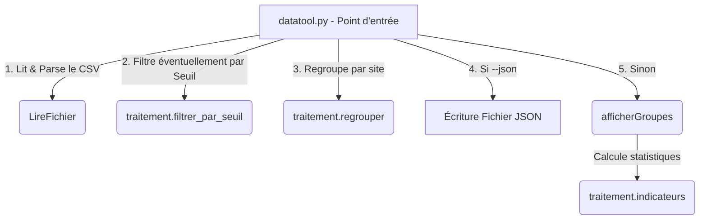

# Spécification de Conception : Correction et Optimisation de `datatool`

Ce document présente l'analyse des anomalies du projet `datatool` et détaille la conception de la solution proposée.

## 1. Diagnostic des Anomalies

| Identifiant | Anomalie | Criticité | Symptôme | Cause | Portée |
| :--- | :--- | :--- | :--- | :--- | :--- |
| **A1** | Tests unitaires cassés | Haute | Échec de `unittest discover` avec `AttributeError`. | Le test appelle `filtre_seuil` qui n'existe pas dans `traitement.py`. | Bloque la validation automatique et l'intégration. |
| **A2** | Filtrage de seuil non conforme | Moyenne | Valeurs égales au seuil (ex: `12.5` pour un seuil de `12.5`) exclues. | Utilisation de `v > seuil` au lieu de `v >= seuil` dans `filtrer_par_seuil`. | Les statistiques et filtrages aux limites sont incorrects. |
| **A3** | Doublons et complexité quadratique dans `regrouper` | Critique | Résultats faux (moyenne fausse) et lenteur extrême sur les grands jeux de données. | Double boucle imbriquée $O(N^2)$ couplée à une logique d'ajout redondante (`append` hors du bloc conditionnel de création). | Toutes les fonctions de regroupement et de calcul d'indicateurs sont erronées. |
| **A4** | Absence de tri des groupes | Moyenne | Les groupes sont affichés dans l'ordre d'apparition. | La fonction `regrouper` ne trie pas les groupes par clé croissante. | Non-respect de la spécification utilisateur. |
| **A5** | Option `--json` non gérée | Moyenne | Option `--json` ignorée ou provoquant une erreur de parsing. | Le point d'entrée `datatool.py` n'implémente pas l'analyse de `--json`. | Impossible d'exporter le résultat au format JSON. |

---

## 2. Conception de la Solution

### A. Optimisation de l'algorithme de regroupement (`traitement.regrouper`)
* **Ancienne approche ($O(N^2)$) :**
  Pour chaque enregistrement, on parcourt la liste des groupes existants. S'il n'existe pas, on reparcourt tous les enregistrements depuis le début pour trouver ses membres.
* **Nouvelle approche ($O(N \log K)$) :**
  On utilise une table de hachage (dictionnaire Python) pour regrouper les membres par clé en un seul passage $O(N)$.
  Ensuite, on extrait les clés et on trie ces clés par ordre croissant en $O(K \log K)$ (où $K$ est le nombre de groupes).
  Cette structure garantit :
  - L'absence de doublons (chaque enregistrement est traité exactement une fois).
  - Une complexité optimisée pour le Big-O.

### B. Gestion robuste des arguments dans `datatool.py`
On implémente un système de parsing manuel propre et lisible pour extraire le chemin du CSV, le seuil optionnel et l'option de sortie JSON, sans importer de bibliothèque lourde externe s'il n'est pas nécessaire.

---

## 3. Structure Finale Attendue de l'Utilitaire

